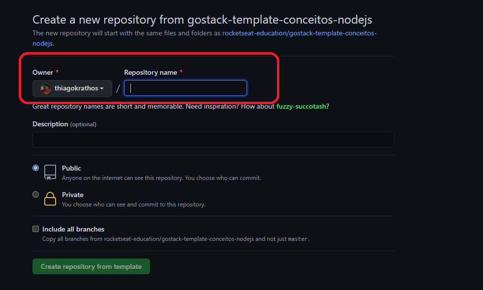

<h2 align="center">
  FAQ referente aos desafios
</h2>

## Dúvidas

- [Como utilizar um repositório do github como template?](#como-utilizar-um-repositório-do-github-como-template)

### Introdução

Para facilitar o entendimento das principais dúvidas, adicionamos alguns passos mostrando tudo que você precisa saber para conseguir entregar os desafios:

### Como utilizar um repositório do github como template?

Você precisará fazer o download de um template que disponibilizamos para ter consigo uma estrutura inicial e os testes que disponibilizamos que serão utilizados na correção desses desafios.

Para isso, você vai precisar criar um novo repositório a partir do template do repositório relacionado ao desafio que você deseja.

Para utilizar esse template, você precisa seguir os seguintes passos:

- **1º passo**: Acesse a página do github do desafio.
- **2º passo**: Dentro da página do github, clique no botão "Use this template" na tela do repositório.

  

- **3º passo**: Após clicar no botão, você será redirecionado para uma nova página que você deve escolher o nome do repositório que você irá criar a partir do template. Dê um nome ao repositório e clique em "Create repository from template".

  

- **4º passo**: Você será redirecionado para a página do seu usuário com o projeto que foi duplicado a partir do template.

- **5º passo**: Para clonar o repositório, clique no botão "Clone or download" e irá aparecer um menu. Copie a URL que aparece logo abaixo do botão.

  

- **6º passo**: No seu terminal, navegue até a sua pasta de preferência e rode o comando `git clone {URL_DO_REPOSITORIO}`, isso irá baixar todos os arquivos para a sua máquina. (Lembre-se que você precisa do Git instalado em sua máquina, caso ainda não tenha: https://git-scm.com/)

- **7º passo**: Agora é só você fazer todas as alterações que você desejar, e envia-las para o github para o repositório que você acabou de criar utilizando o template.

**Dica**: Caso você não tenha conhecimento sobre Git & Github, de uma olhada nesse artigo, que nos mostra os principais comando e utilização para a conclusão do desafio.
(https://terminalroot.com.br/git/)

## :memo: Licença

Esse projeto está sob a licença MIT. Veja o arquivo [LICENSE](../LICENSE) para mais detalhes.

---

Feito com 💜 by Thiago Almeida :wave:
